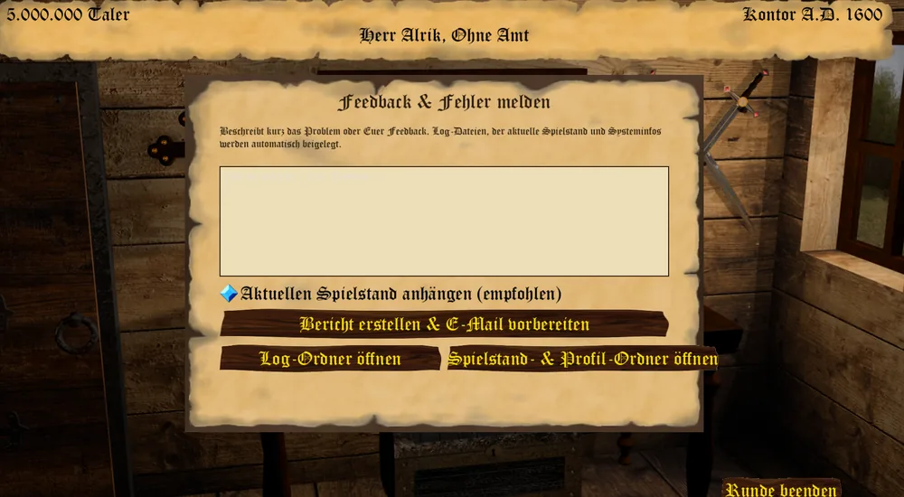

"Ein Fehler, der nicht gemeldet wird, bleibt ein Fehler für alle." - Sprichwort -

Über den Knopf **Feedback & Fehler melden** im Hauptmenü oder **Feedback** im Ingame-Menü (Esc im
Kontor) erreicht Ihr den Melde-Dialog. Ist beim vorigen Programmstart ein unbehandelter Fehler
aufgetreten, bietet Euch das Hauptmenü außerdem von sich aus an, ihn zu melden.

## Was passiert beim Melden

Beschreibt im Textfeld kurz, was passiert ist. Der Schalter **Aktuellen Spielstand anhängen** ist
vorbelegt und legt den laufenden bzw. zuletzt gespeicherten Spielstand sowie Eure Profildatei mit ins
Paket. Der Knopf **Bericht erstellen & E-Mail vorbereiten** baut daraus ein ZIP mit:

* den letzten Log-Dateien,
* einer eventuell vorhandenen Absturz-Datei aus einem vorigen Programmstart,
* optional dem Spielstand und der Profildatei,
* einer Systeminfo-Datei mit Zeitpunkt, Spielversion, Godot- und .NET-Version, Betriebssystem und
  Eurer Beschreibung.

Anschließend öffnet der Client Euer Standard-E-Mail-Programm mit vorausgefülltem Empfänger
(`mail@conspiratio.net`), Betreff und Text und zeigt die erzeugte ZIP-Datei im Dateimanager markiert
an. Ihr müsst sie nur noch an die E-Mail anhängen und absenden - der Client verschickt nichts von sich
aus.

## Schnellzugriffe

Die beiden weiteren Knöpfe öffnen direkt den Ordner mit den Log-Dateien bzw. den Ordner mit Euren
Spielständen und der Profildatei im Dateimanager, ohne erst einen Bericht zu erstellen.
