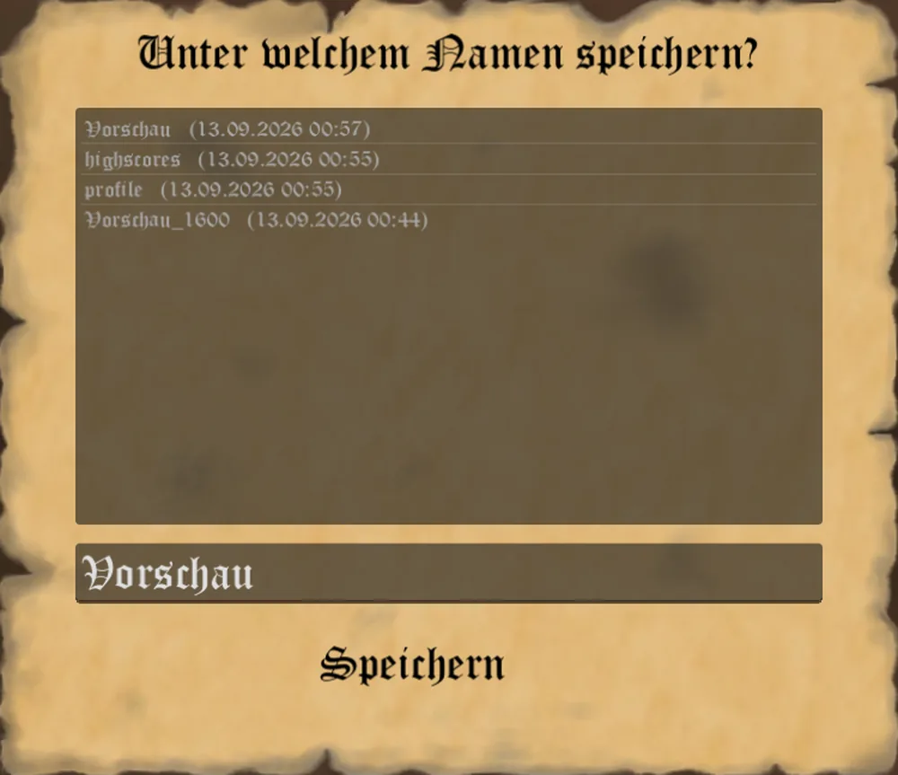
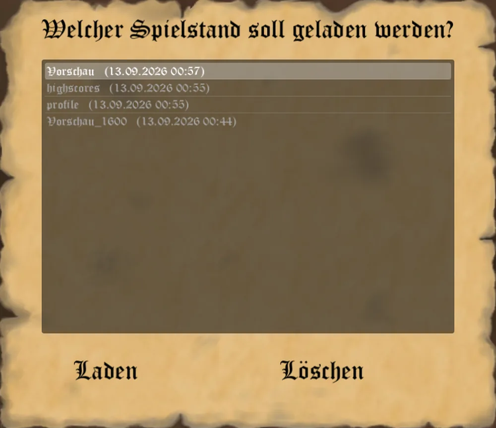

"Was schriftlich festgehalten ist, kann der Zeit trotzen." - Sprichwort -

## Wo Eure Spielstände liegen

Der Godot-Client legt Eure Spielstände in denselben Ordner wie der alte WinForms-Client:
`%AppData%\Roaming\Conspiratio` (also `C:\Users\<Euer Name>\AppData\Roaming\Conspiratio`). Dort liegen
auch die Profildatei (`profile.json`) und die lokale Bestenliste (`highscores.json`). Ein Spielstand ist
eine offene, von Hand editierbare JSON-Datei; ein noch vorhandener alter Spielstand des WinForms-Clients
(`*.dat`) wird beim Laden automatisch in das neue Format umgewandelt.

## Automatisch: der Autosave

Zu Beginn jedes Zuges speichert der Client automatisch unter dem Namen `<Spielname>_<Jahr>` und löscht
dabei den vorvorletzten Autosave - es bleiben also stets die beiden jüngsten Autosaves erhalten.

## Von Hand speichern

Über das Ingame-Menü (Esc im Kontor) öffnet **Speichern** den Speichern-Dialog: Er listet die
vorhandenen Spielstände mit ihrem letzten Änderungsdatum, das Namensfeld ist mit dem aktuellen
Spielnamen vorbelegt. Wählt Ihr einen bereits vorhandenen Namen, fragt der Client vor dem Überschreiben
noch einmal nach.

Verlasst Ihr ein laufendes Spiel über das Ingame-Menü in Richtung Hauptmenü, fragt der Client
zusätzlich, ob er vorher unter dem aktuellen Spielnamen speichern soll.

## Laden

**Laden** im Ingame-Menü sowie **Spiel laden** im lokalen Spielmenü öffnen denselben Dialog: Er listet
alle vorhandenen Spielstände, ein Doppelklick oder der Knopf **Laden** lädt den ausgewählten, der Knopf
**Löschen** entfernt ihn nach Rückfrage. **Spiel fortsetzen** im lokalen Spielmenü lädt ohne Umweg über
diese Liste direkt den zuletzt gespeicherten oder geladenen Spielstand.

