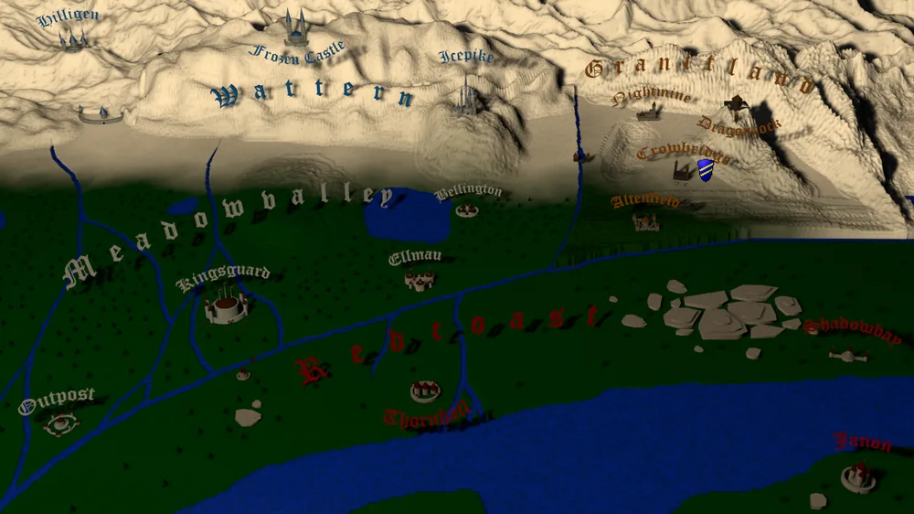

_"Der Kluge verkauft seinen Essig teurer, als der Narr seinen Honig." - Sprichwort -_

Die Produktion und der kluge Verkauf von Waren ist das Rückgrat dieses Spieles und Eures Erfolges. Mit einem leeren Beutel, lässt sich schlecht Geschäfte und Politik machen. Auch Amt und Würden folgen nur dem Klingeln eures prall gefüllten Beutels.
Hab also immer ein Auge auf eure Produktionsstätten. Plant weise und vorausschauend.

Ihr gelangt zum Übersicht für Produktion und Handel indem ihr auf die Landkarte an der Wand klickt.
Nun öffnet sich die Karte des Königreiches und ihr könnt die verschiedenen Städt und Grafschaften sehen.

Rechts von den Städten sehr ihr Euer bei Spielbeginn gewähltes Wappen an den Städten, in denen ihr bereits einen Wohnsitz euer Eigen nennt.
Nur in Städten mit Wohnsitz könnt ihr Produktionsstätten einrichten. Die Größe des Wohnsitzes spielt hierbei keine Rolle.

