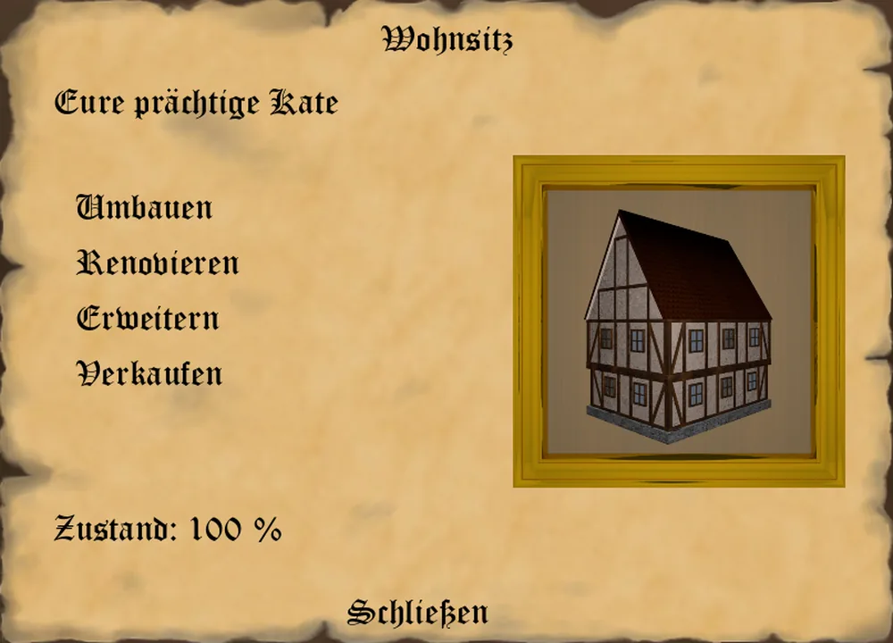

Um in einer Stadt eine Produktion aufbauen zu können, benötigt ihr zunächst eine Bleibe.
Im Stadtfenster unten rechts findet ihr eine Schaltfläche, in der ihr in das Menü für den Wohnsitz in der Stadt kommt.
Hier stehen euch nun mehrere Optionen zur Verfügung.

* Wohnsitz bauen, erweitern,renovieren und verkaufen
* Werkstätten errichten und betreiben
* Lagerraum kaufen und verkaufen
* Waren verkaufen
* Waren exportieren

