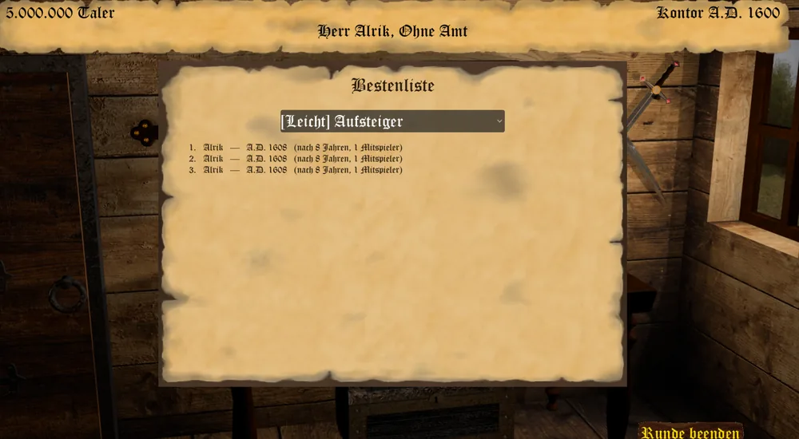

_"Nicht der Sieg allein zählt, sondern der Weg, auf dem er errungen wurde." - Sprichwort -_

Wer nicht ins offene, endlose Spiel ziehen will, kann sich beim Anlegen eines neuen Spiels stattdessen
einem Auftrag stellen: einem festen Ziel mit eigener Schwierigkeitsstufe, dessen Erfüllung das Spiel
sofort gewinnt.

## Die Aufträge

Beim Anlegen eines neuen Spiels wählt Ihr zunächst eine Schwierigkeitsstufe - **Keine (freies Spiel)**,
**Leicht**, **Mittel** oder **Schwer** - und danach einen der zu dieser Stufe gehörenden Aufträge:

**Leicht**

* **Aufsteiger** - erlangt ein beliebiges Amt.
* **Kleiner Wohlstand** - besitzt 100.000 Taler.
* **Kaufmann** - erzielt einen Gesamtumsatz von 200.000 Talern.
* **Familienvater** - zeugt 3 Kinder.

**Mittel**

* **Herr des Doms** - werdet Domherr und bleibt es 7 Jahre in Folge.
* **Mäzen** - stiftet dem Reich Bauwerke im Gesamtwert von 160.000 Talern.
* **Baumeister** - errichtet 10 Häuser.
* **Wahlsieger** - gewinnt 3 Wahlen.
* **Kriegsheld** - gewinnt 10 Kämpfe.

**Schwer**

* **Talerrennen** - besitzt als Erster 1.000.000 Taler.
* **Kriegsherr** - erobert 5 gegnerische Stützpunkte.
* **Karawanenschreck** - überfallt 8 Karawanen.
* **Meuchelmörder** - verübt 3 erfolgreiche Anschläge.

Zu Beginn jedes Zuges erinnert Euch der Client mit einer eigenen Zeile an Euren Fortschritt.

## Der Sieg

Erfüllt Ihr Euren Auftrag, erscheint sofort ein Siegesbildschirm mit Glückwunsch, Auftragsname,
Spieljahr und der Zahl der vergangenen Spieljahre. Ihr könnt Euch darin unter Eurem Namen in die lokale
Bestenliste eintragen; ein Rechtsklick oder Esc schließt den Bildschirm - und beendet damit das Spiel,
es geht zurück ins Hauptmenü.

## Die Bestenliste

Über den Knopf **Bestenliste** im Hauptmenü seht Ihr zu jedem Auftrag die Liste der bisherigen
Sieger, sortiert danach, wer am schnellsten war: Wer denselben Auftrag in weniger Spieljahren erfüllt
hat, steht weiter oben. Zu jedem Eintrag stehen Name, das erreichte Spieljahr, die Zahl der
gespielten Jahre und die Anzahl der menschlichen Mitspieler jener Partie. Für einen Auftrag ohne
Einträge zeigt die Liste entsprechend an, dass es noch keine gibt.

Die Bestenliste ist lokal - sie liegt bei Euren Spielständen und wird nicht mit anderen Spielern
geteilt. Ein mit aktivem Cheatmodus gewonnenes Spiel trägt sich nicht in die Bestenliste ein.
