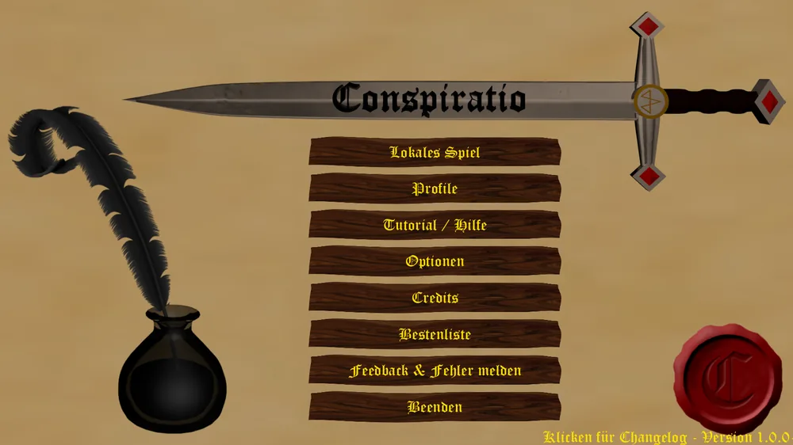
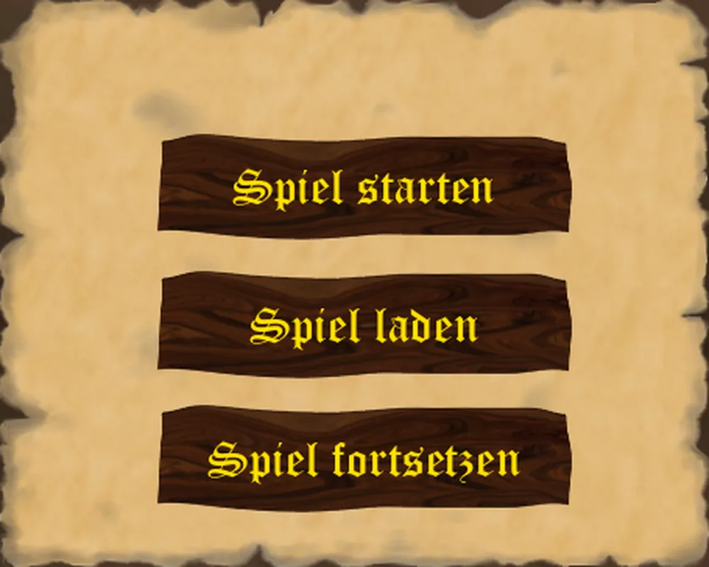
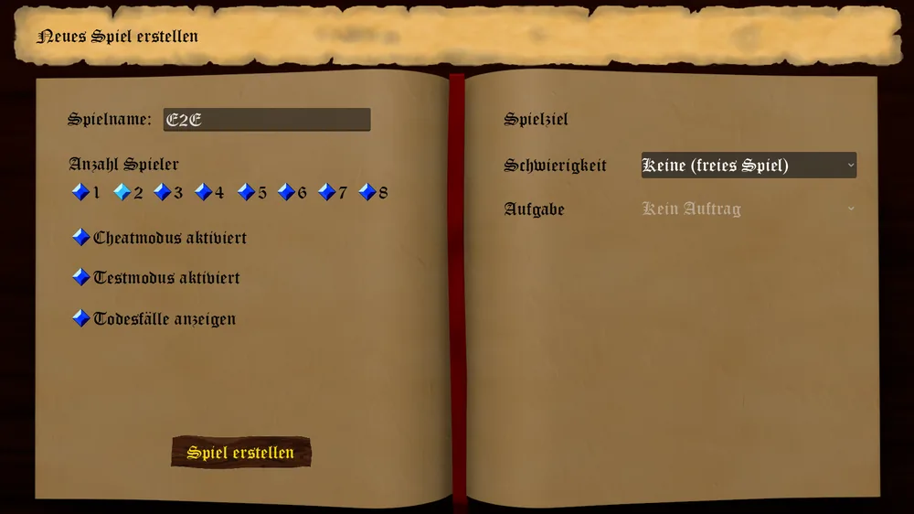
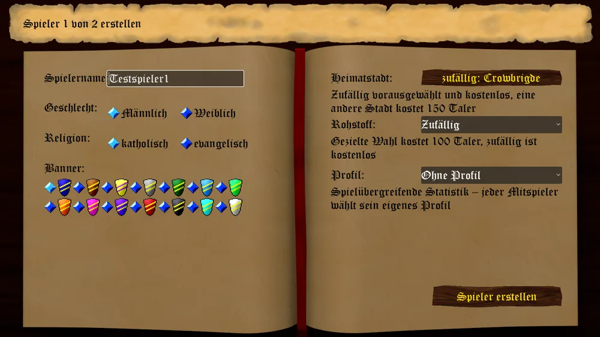
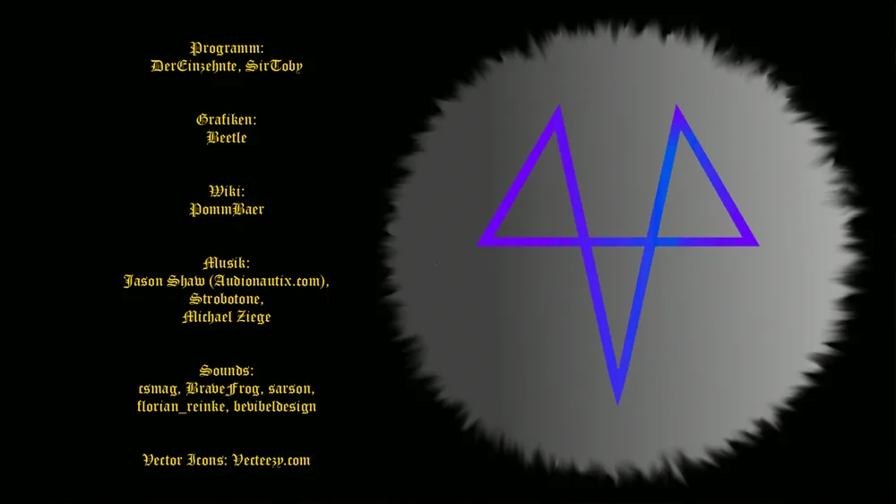

_**Willkommen im Königreich Lottringen.**_

Wollt Ihr, oh edle Person, Ruh und Reichtum Eurer begonnenen Dynastie weiter mehren?
So seid Ihr hier an der richtigen Stelle.

Und Ihr? Nichtsnutzig, ohne Amt und Würde? Wollt Ihr, mit den wenigen Euch zur Verfügung stehenden Mittel zu Ruhm und Ehre gelangen?
Oder wollt Ihr Euer armseliges Dasein so wie bisher weiter fristen?
Ihr könnt es versuchen.
Doch lasset Euch geraten sein - seid auf der Hut!
Diebesgesindel, mit und ohne Adelstitel, wird versuchen Euch mit aller Macht in die schäbige Kate zurückzuwerfen, aus der Ihr gekommen seid.

Hier im Hauptmenü trennen sich die Wege. Seid Ihr noch ohne Amt und Würden, könnt ihr Eure Dynastie gründen und euch mit elektronischen oder menschlichen Kontrahenten messen.

# Hotseat Spiel

Hier stehen drei Möglichkeiten zur Verfügung.

## Spiel starten

Folgende Auswahl müsst ihr hierfür treffen:
* Spielname ( merken - Ihr müsst ihn zum Laden später eingeben )
* Anzahl ( menschlicher Spieler )
* Cheaten an / aus
* Todesfälle anzeigen an / aus
* Testmodus an / aus

Habt Ihr eure Auswahl getroffen, benötigt Ihr nun eine Informationen, um die Startbedingungen zu definieren.

* Name des als ersten Spielenden
* Geschlecht des als ersten Spielenden
* Banner des als ersten Spielenden (damit erkennt ihr später eure Kontore, Burgen, Räuberlager
* Startstadt des als ersten Spielenden 
* Rohstoff, den Ihr als erstes herstellen könnt
* Religion ( gibt Euch Ansehen und Missgunst bei der jeweilig anderen Religion )

Bestätigt nach der vollständigen Wahl mit einem Rechtsklick und gebt gegebenenfalls noch folgende Spielende ein.
Anschließend kommt Ihr zum Startbildschirm der ersten Runde.

## Spielstand laden

Seid Ihr schon zu Wohlstand gekommen, so könnt Ihr hier einen Spielstand laden.
Gebt dafür den Namen des gespeicherten Spiel ein.

## Gespeichertes Spiel fortsetzen

Dies bringt euch zurück zur aktuellen Runde des laufenden Spieles.

# Tutorial / Hilfe

Bringt Euch zu diesem Wiki hier.

# Optionen

Hier lassen sich die üblichen Parameter wie Soundlautstärken, Tipps an / aus und die Aggressivität der Kontrahenten einstellen.

# Credits

Ehre, wem Ehre gebührt. Hier könnt ihr die Macher hinter diesem genialen Spiel sehen und die jeweilige Programmversion.

### Weiterführendes

Zur Unterstützung haben wir euch auch ein paar tolle Videoanleitung der ersten Spielrunden zur Verfügung gestellt: [Link zur YouTube Playlist](https://www.youtube.com/playlist?list=PL9py64t74E7nADhp2_BcDGga_QneGus3y)