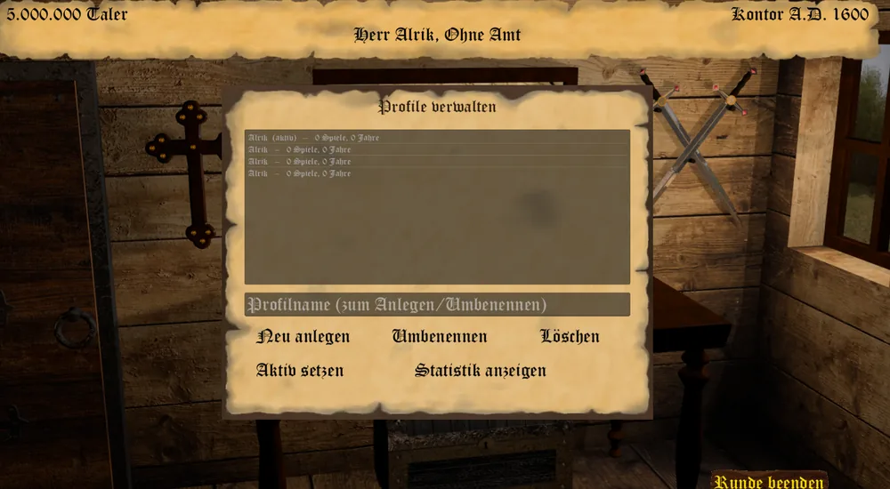
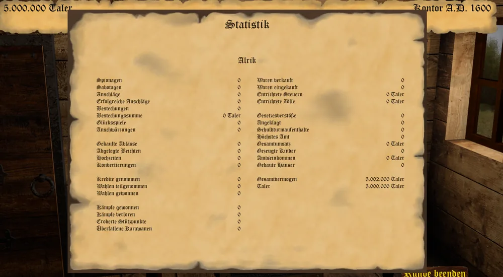

_"Der Ruf eines Hauses überdauert ein einzelnes Spiel." - Sprichwort -_

Neben der Statistik eines einzelnen Spiels führt Conspiratio auch eine spielübergreifende Wertung:
das Profil. Ein Profil sammelt die Kennzahlen aller Spiele, in denen es einem menschlichen Spieler
zugeordnet war.

## Profile verwalten

Über den Knopf **Profile** im Hauptmenü öffnet sich die Profilverwaltung. Sie listet alle angelegten
Profile mit der Zahl ihrer Spiele und gespielten Jahre, markiert das aktive Profil und bietet:

* **Neu anlegen** - legt unter dem eingegebenen Namen ein neues Profil an (bis zu 30 Zeichen); ist es
  das erste, wird es zugleich aktiv.
* **Umbenennen** - benennt das ausgewählte Profil um.
* **Aktiv setzen** - macht das ausgewählte Profil zum aktiven.
* **Statistik anzeigen** - öffnet seine spielübergreifende Statistik.
* **Löschen** - entfernt das ausgewählte Profil samt seiner gesamten Statistik, nach Rückfrage
  unwiderruflich.

## Profile einem Spiel zuordnen

Beim Erstellen der Spieler eines neuen Spiels bietet Euch der Client zu jedem menschlichen Spieler ein
Auswahlfeld mit **Ohne Profil** sowie allen noch nicht in diesem Spiel vergebenen Profilen - ein Profil
kann also nicht doppelt an zwei Spieler desselben Spiels vergeben werden. Der erste Spieler ist dabei
bereits auf das aktive Profil vorausgewählt.

## Wie gewertet wird

Bei jedem Speichern - von Hand, per Autosave oder beim Verlassen ins Hauptmenü - faltet der Client den
Zuwachs der Statistik jedes zugeordneten menschlichen Spielers seit der letzten Wertung in dessen
Profil ein. Mehrfaches Speichern zählt dabei nicht doppelt, da nur die Differenz zum zuletzt gewerteten
Stand einfließt. Ein Spiel mit aktivem Cheatmodus wird grundsätzlich nicht gewertet, da sich darin
Taler und Ansehen frei setzen lassen.

Gezählt werden unter anderem Spionagen, Sabotagen, Anschläge, Bestechungen, Glücksspiele und
Anschwärzungen; Ablässe, Beichten, Hochzeiten und Konvertierungen; genommene Kredite sowie
Wahlteilnahmen und -siege; gewonnene und verlorene Kämpfe, eroberte Stützpunkte und überfallene
Karawanen; verkaufte und eingekaufte Waren, entrichtete Steuern und Zölle, Gesetzesverstöße,
Anklagen und Schuldturmaufenthalte, Gesamtumsatz, gezeugte Kinder, Amtseinkommen und gebaute Häuser.
Dazu kommen das insgesamt höchste erreichte Amt und das höchste je erreichte Vermögen sowie die Zahl
der gespielten Spiele und Jahre.

