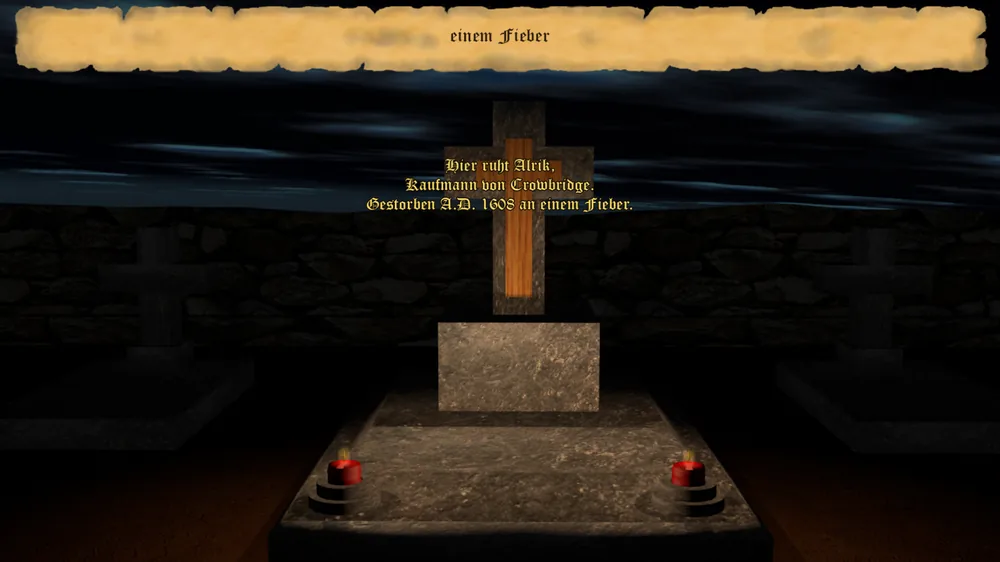

_"Was der Mensch gesät hat, das steht am Ende auf seinem Grabstein geschrieben." – Sprichwort –_

Stirbt Euer Spieler, öffnet sich statt des Kontors ein letzter Bildschirm: Im oberen Banner steht die
Todesursache, auf dem Grabstein selbst die Grabinschrift.

## Was auf dem Stein steht

Die Inschrift setzt sich aus Name, Titel, Lebensdaten, einem zur Spielweise passenden Grabspruch und
einem Hinweis auf die Erbfolge zusammen – etwa:

> Hier ruht Alrik, Kaufmann von Crowbridge
> \* 1550 † 1608
>
> „Er zählte Taler, wie andere ihre Sünden zählen – gewissenhaft und ohne Reue. Sein Kontor überlebt ihn."
>
> Alrik der Jüngere tritt das Erbe an und führt die Dynastie fort.

Der letzte Satz stammt aus dem [Testament](testament-und-erbfolge.md): Er meldet, wer die Dynastie
fortführt – oder dass sie mit dem Verstorbenen endet.

## Woher der Grabspruch kommt

Der Spruch ist kein Zufallstext, sondern richtet sich nach der über das ganze Spiel geführten Statistik
des Verstorbenen. Sieben Spielweisen stehen zur Wahl, jede mit einer eigenen Wertung aus mehreren
Statistikwerten:

* **Kriegsherr** – gewonnene Kämpfe, eroberte Stützpunkte, überfallene Karawanen
* **Intrigant** – versuchte und geglückte Ermordungen, Sabotagen, Spionagen, Anschwärzungen, Bestechungen
* **Kaufmann** – verkaufte und eingekaufte Waren, Gesamtumsatz
* **Kirchenmann** – gekaufte Ablässe, abgelegte Beichten, Konvertierungen
* **Staatsmann** – höchstes erreichtes Amt, gewonnene Wahlen, Amtseinkommen
* **Patriarch** – gezeugte Kinder
* **Gesetzloser** – gebrochene Gesetze, Anklagen, Aufenthalte im Schuldturm

Die Spielweise mit der höchsten Wertung gewinnt – aber nur, wenn sie deutlich genug heraussticht. Sticht
keine Spielweise klar hervor, bekommt der Verstorbene stattdessen einen allgemeinen, unauffälligen
Spruch wie „Er lebte, er handelte, er ging dahin. Ein Leben wie viele – doch es war das seine." Zu jeder
Spielweise gehören mehrere mögliche Sprüche, von denen einer zufällig gewählt wird – kein Grabstein
gleicht also zwangsläufig dem nächsten, selbst bei gleicher Lebensgeschichte.

## Der Tod eines Kindes

Stirbt statt Eurer selbst eines Eurer Kinder, öffnet sich ein eigener, schlichterer Bildschirm vor
demselben Grabstein-Hintergrund: unter der Überschrift „Tragischer Verlust" steht die Nachricht zum
verstorbenen Kind, ohne eine eigene Grabinschrift oder Spielweise-Auswertung.

