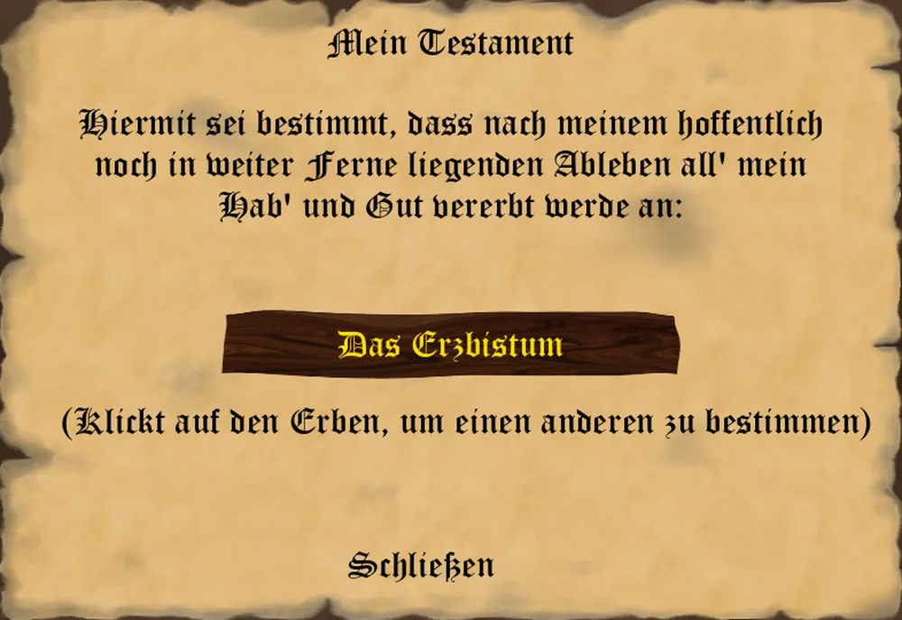

_"Wer ohne Testament stirbt, überlässt sein Erbe dem Zufall." – Sprichwort –_

Eine Dynastie stirbt nicht nur durch das Schwert oder das Fieber – sie stirbt auch, wenn niemand
bestimmt hat, wer sie fortführen soll. Das Privileg „Testament machen" legt genau das für Euch fest.

## Nachwuchs

Ist Euer Charakter verheiratet, kann am Ende Eures Zuges ein Kind zur Welt kommen. Die Geburt wird verkündet -
Sohn oder Tochter - und Ihr bestimmt sofort den Namen, unter dem das Kind fortan in Eurer Familie
geführt wird.

## Wer erben kann

Das Privileg steht Euch offen, sobald Ihr verheiratet seid oder mindestens ein lebendes Kind habt. Im
Testament klickt Ihr auf den derzeitigen Erben, um durch die möglichen Erben zu blättern:

* das Erzbistum (die Vorbelegung – dazu gleich mehr),
* Euer Ehepartner, sofern Ihr verheiratet seid,
* jedes Eurer lebenden Kinder.

Jeder Klick setzt den neuen Erben sofort; ein erneutes Öffnen des Testaments zeigt Euch, wen Ihr zuletzt
bestimmt habt.

## Kinder erben nicht von selbst

Eine Heirat oder die Geburt eines Kindes setzt für sich genommen **keinen** Erben. Solange Ihr das
Testament nicht ausdrücklich auf Ehepartner oder Kind umstellt, bleibt „Das Erzbistum" hinterlegt – und
das bedeutet beim Tod: kein Erbe. Wer seine Dynastie über den eigenen Tod hinaus fortführen will, muss
das Testament also aktiv anfassen, und zwar erneut, sobald ein neues Kind zur Wahl steht.

## Was beim Tod geschieht

Stirbt der Spieler, wird das Testament vollstreckt:

* **Ohne Erben** scheidet der Spieler aus dem Spiel aus – seine Dynastie endet. Ist er der letzte
  menschliche Spieler in der Runde, endet damit das ganze Spiel.
* **Erbt der Ehepartner oder ein Kind**, übernimmt dieser die Identität des Verstorbenen und führt die
  Dynastie fort. Vor der Übernahme wird die scheidende Generation – das verstorbene Oberhaupt, sein
  Ehepartner und alle Kinder – in der Ahnentafel festgehalten, damit sie nicht mit dem Generationswechsel
  verloren geht.

In beiden Fällen wird ein zu Lebzeiten bekleidetes Amt **nicht** vererbt: Es wird wie bei jedem Todesfall
freigegeben und steht im nächsten Jahr zur Neuwahl – auch dann, wenn der Erbe selbst der bisherige
Amtsinhaber gewesen wäre, etwa als erbender Ehepartner mit eigenem Amt.

## Auf dem Grabstein

Die Vollstreckung des Testaments steht auch auf dem [Grabstein](grabinschrift.md): Je nachdem, ob die
Dynastie fortgeführt wurde oder mit dem Verstorbenen endete, schließt die Grabinschrift mit einem
entsprechenden Satz.

