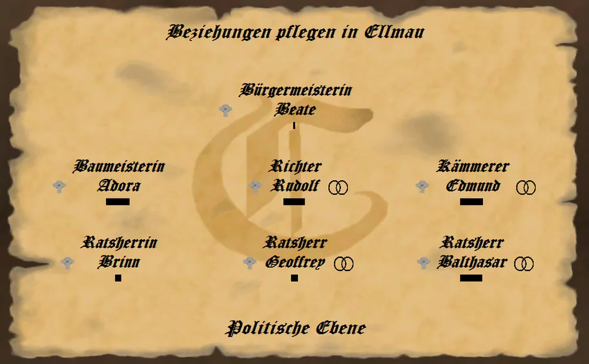
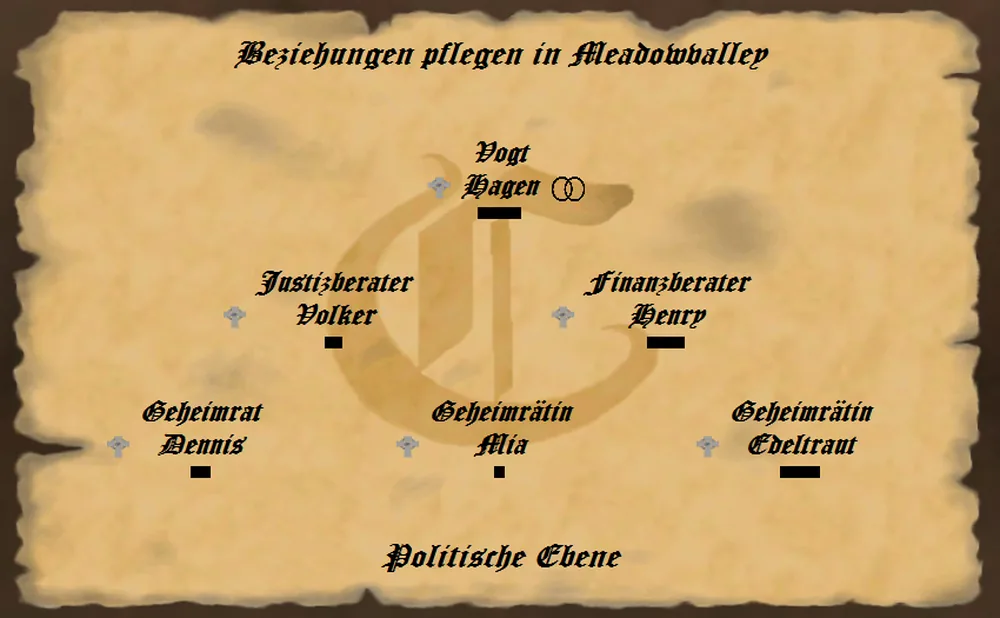
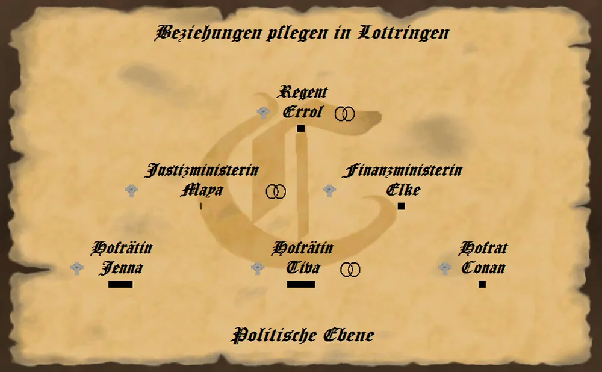
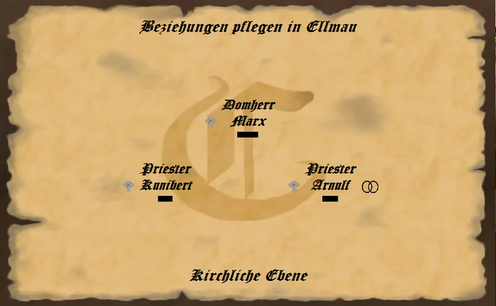
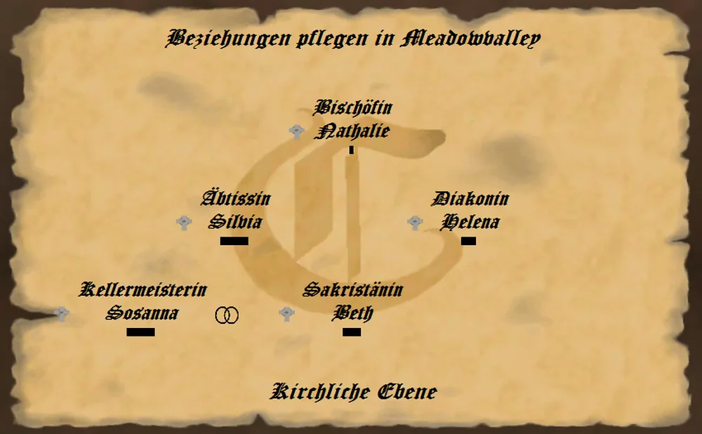
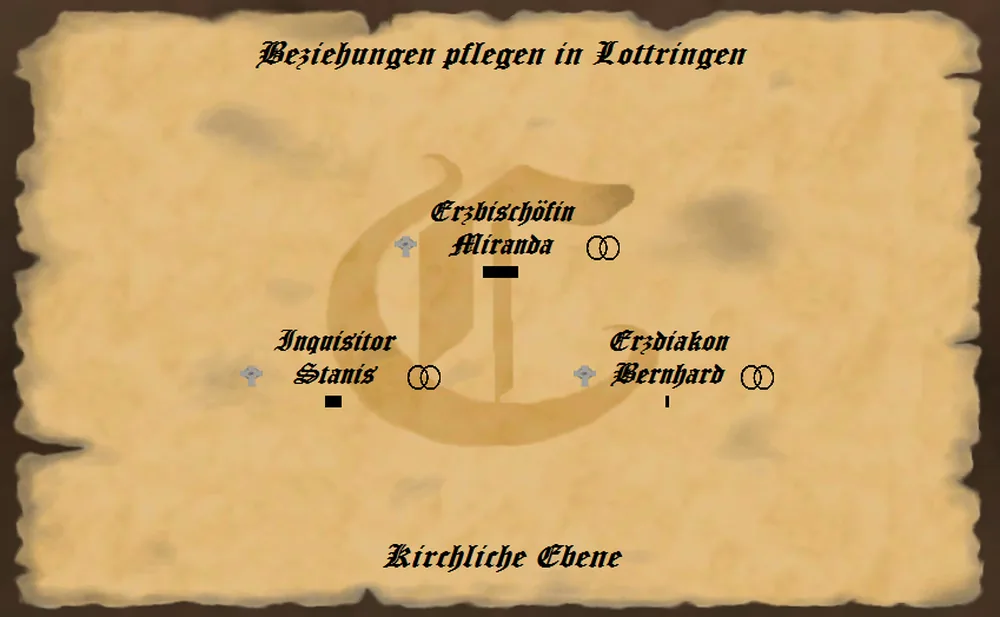
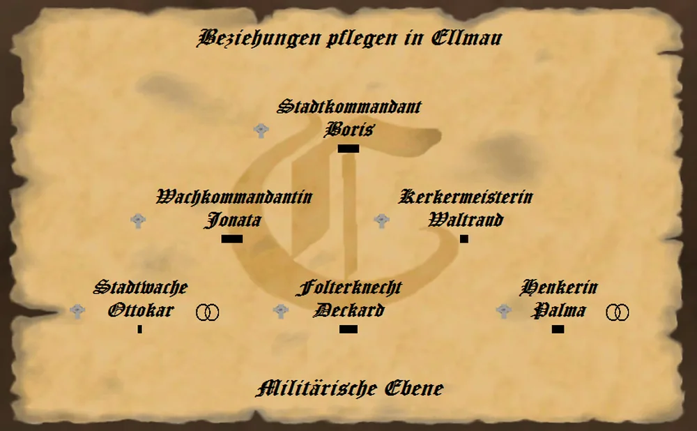
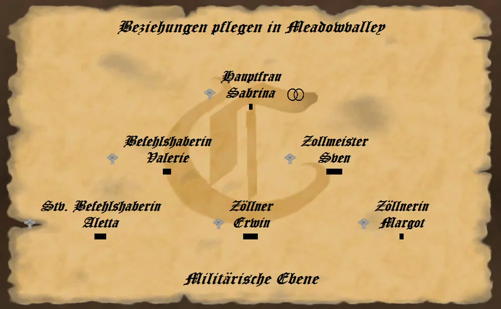
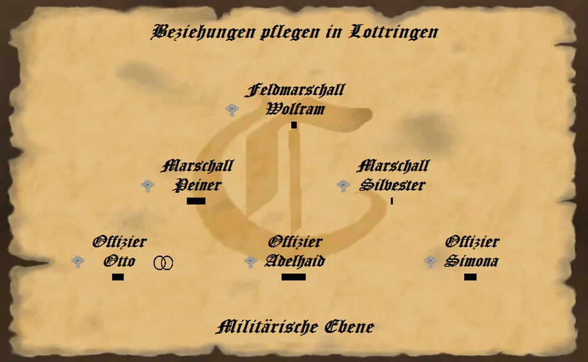

_"Ein Amt ist gut: man legt es zwischen sich und die Menschen." - Friedrich Wilhelm Nietzsche, deutscher Philosoph, Essayist, Lyriker und Schriftsteller -_

Die Wahl in ein Amt verschafft Euch Vorteile auf unterschiedlichste Art und Weise. Nicht immer ist ein neues, höheres Amt auch die bessere Wahl. Dies hängt stark von Eurer aktuellen Situation und Eurer Spielstrategie ab. So kann das Amt des Kellermeisters in Kombination mit einem Handelszertifikat für Wein Euch mehr Taler pro Runde bringen, als die Produktion von Wein mit einem anderen Amt.

Bedenkt also gut, ob Ihr Euch für ein neues Amt bewerbt.

Ämter sind nicht vererbbar. Eure Nachfahren werden, wie Ihr einst, den langen Weg von unten nach oben auf der Karriereleiter antreten müssen.

Es gibt drei verschiedene Amtsebenen zur Aufrechterhaltung des Königreiches zu besetzen.
Die politische Ebene, die kirchliche Ebene und die millitärische Ebene.

# 2.1.1.1 Politische Ämter

## **politische Ämter je Stadt**

_**Ratsherr**_
* gewählt von:	  Baumeister, Richter und Kämmerer
* wählt:            niemanden
* Privilegien:      Steuerhinterziehung A, Einkommen 700 T

_**Baumeister**_	
* gewählt von:	  Bürgermeister	
* wählt:            Ratsherren
* Privilegien:      Untergebene, Einkommen 1.000 T
	
_**Richter**_	
* gewählt von:	  Bürgermeister	
* wählt:            Ratsherren	
* Privilegien:      Untergebene, Einkommen 900 T

_**Kämmerer**_
* gewählt von:	  Bürgermeister	
* wählt:            Ratsherren	
* Privilegien: Untergebene, Einkommen 800 T

_**Bürgermeister**_
* gewählt von:	  Vogt	
* wählt:            Baumeister, Richter und Kämmerer	
* Privilegien:      Umsatzsteuer festlegen, Einkommen 1.500 T, Untergebene

## **politische Ämter je Grafschaft**

### Vorraussetzungen:

* zwei Anwesen in der jeweiligen Grafschaft
* Bürgermeister oder Domherr in einer Stadt der jeweiligen Grafschaft

_**Geheimrat**_
* gewählt von:	  Justizberater, Finanzberater	
* wählt:            niemanden	
* Privilegien:      Steuerhinterziehung B, Einkommen 2.000 T, Bauwerk stiften

_**Justizberater**_
* gewählt von:	  Vogt	
* wählt:            Geheimrat	
* Privilegien:      Einkommen 5.000 T, Untergebene, Bauwerk stiften

_**Finanzberater**_
* gewählt von:	  Vogt	
* wählt:            Geheimrat	
* Privilegien: Untergebene, Bauwerk stiften

_**Vogt**_
* gewählt von:	  Regent	
* wählt:            Bürgermeister, Justizberater, Finanzberater	
* Privilegien:      Wachen, Günstige Kredite, Einkommen 8.000 T, Untergebene, Bauwerk stiften

## **politische Ämter im Königreich**

### Vorraussetzungen:

* Titel Freiherr/Freifrau oder höher
* Vogt, Bischof oder Hauptmann in einer Grafschaft

_**Hofrat**_
* gewählt von:	  Justizminister, Finanzminister	
* wählt:            niemanden	
* Privilegien: Wachen, Bauwerk stiften, Einkommen 10.000 T

_**Justizminister**_
* gewählt von:	  Regent	
* wählt:            Hofrat	
* Privilegien: Strafgesetze festlegen, Untergebene, Bauwerk stiften, Einkommen 15.000 T

_**Finanzminister**_	
* gewählt von:	  Regent	
* wählt:            Hofrat	
* Privilegien: Finanzgesetze festlegen, Untergebene , Bauwerk stiften, Einkommen 20.000 T

_**Regent**_	
* gewählt von:	  niemanden	
* wählt:            Justizminister, Finanzminister	
* Privilegien: Leibgarde, Untergebene , Bauwerk stiften, Einkommen 50.000 T

# 2.1.1.2 Kirchliche Ämter

## **kirchliche Ämter in der Stadt**

_**Priester**_	
* gewählt von:	  Domherr
* wählt:            niemanden	
* Privilegien:     Confessio, Prediger, Einkommen 200 T

_**Domherr**_	
* gewählt von:	  Bischof
* wählt:            Priester
* Privilegien:     kein Kirchenzehnt, Untergebene, Einkommen 700 T

## **kirchliche Ämter in der Grafschaft**

### Vorraussetzungen:

* zwei Anwesen in der jeweiligen Grafschaft
* Bürgermeister oder Domherr in einer Stadt der jeweiligen Grafschaft

_**Kellermeister**_	
* gewählt von:	  Abt, Diakon
* wählt:            niemanden	
* Privilegien:     Vergifteter Wein, kein Kirchenzehnt, Bauwerk stiften, Einkommen 500 T

_**Sakristan**_	
* gewählt von:	  Abt, Diakon
* wählt:            niemanden
* Privilegien:    kein Kirchenzehnt, Bauwerk stiften, Einkommen 700 T

_**Diakon**_	
* gewählt von:	  Bischof
* wählt:     Kellermeister, Sakristan
* Privilegien:   kein Kirchenzehnt, Untergebene, Bauwerk stiften, Einkommen 1.600 T

_**Abt**_
* gewählt von:	  Bischof
* wählt:            Kellermeister, Sakristan
* Privilegien:     kein Kirchenzehnt, Untergebene, Bauwerk stiften, Einkommen 1.300 T

_**Bischof**_
* gewählt von:	  Erzbischof
* wählt:            Domherr, Kellermeister, Sakristan
* Privilegien:     kein Kirchenzehnt, Untergebene, Wachen, Bauwerk stiften, Einkommen 4.000 T

## **kirchliche Ämter im Königreich**

### Vorraussetzungen:

* Titel Freiherr/Freifrau oder höher
* Vogt, Bischof oder Hauptmann in einer Grafschaft

_**Inquisitor**_
* gewählt von:	  Erzbischof
* wählt:           niemanden 
* Privilegien:     kein Kirchenzehnt, Bauwerk stiften, Einkommen 5.000 T

_**Erzdiakon**_
* gewählt von:	  Erzbischof
* wählt:           niemanden 
* Privilegien:     kein Kirchenzehnt, Bauwerk stiften, Einkommen  8.000 T

_**Erzbischof**_
* gewählt von:	  niemanden
* wählt:          Bischof, Inquisitor, Erzdiakon  
* Privilegien:   Leibgarde, Kirchengesetze festlegen, kein Kirchenzehnt, Untergebene, Bauwerk stiften, Einkommen 20.000 T
  
# 2.1.1.3 Millitärische Ämter

## **millitärische Ämter in der Stadt**

_**Stadtwache**_
* gewählt von:	  Wachkommandant, Kerkermeister
* wählt:          niemanden 
* Privilegien:    Einkommen 150 T

_**Folterknecht**_
* gewählt von:	  Wachkommandant, Kerkermeister
* wählt:          niemanden
* Privilegien:    Einkommen 150 T

_**Henker**_
* gewählt von:	  Wachkommandant, Kerkermeister
* wählt:          niemanden  
* Privilegien:    Einkommen 150 T

_**Wachkommandant**_
* gewählt von:	  Stadtkommandant
* wählt:          Stadtwache, Folterknecht, Henker 
* Privilegien:  Einkommen 350 T, Untergebene 
   
_**Kerkermeister**_
* gewählt von:	  Stadtkommandant
* wählt:           Stadtwache, Folterknecht, Henker 
* Privilegien: Kerkerklatsch, Untergebene, Einkommen 350 T
    
_**Stadtkommandant**_
* gewählt von:	  Hauptmann
* wählt:          Wachkommandant, Kerkermeister  
* Privilegien:    Untergebene, Einkommen 800 T

## **millitärische Ämter in der Grafschaft**

### Vorraussetzungen:

* zwei Anwesen in der jeweiligen Grafschaft
* Bürgermeister oder Domherr in einer Stadt der jeweiligen Grafschaft

_**Stellvertretender Befehlshaber**_
* gewählt von:	Befehlshaber, Zollmeister  
* wählt:       Niemanden     
* Privilegien:  Bauwerk stiften, Einkommen 1.000 T

_**Zöllner**_
* gewählt von:	Befehlshaber, Zollmeister  
* wählt:        Niemanden    
* Privilegien:   Schmuggel, Bauwerk stiften, Einkommen 1.000 T

_**Befehlshaber**_
* gewählt von:	  Hauptmann
* wählt:         Stellvertretenden Befehlshaber, Zöllner   
* Privilegien:  Untergebene, Bauwerk stiften, Einkommen 2.000 T

_**Zollmeister**_
* gewählt von:	  Hauptmann
* wählt:          Stellvertretenden Befehlshaber, Zöllner  
* Privilegien:  Schmuggel, Zollkartell, Untergebene, Bauwerk stiften, Einkommen 2.000 T

_**Hauptmann**_
* gewählt von:	  Feldmarschall
* wählt:         Stadtkommandant, Befehlshaber, Zollmeister   
* Privilegien:   Untergebene, Wachen, Bauwerk stiften, Einkommen 3.000 T

## **millitärische Ämter im Königreich**

### Vorraussetzungen:

* Titel Freiherr/Freifrau oder höher
* Vogt, Bischof oder Hauptmann in einer Grafschaft

_**Offizier**_
* gewählt von:	Marschall
* wählt:      Niemanden      
* Privilegien:  Bauwerk stiften, Einkommen 4.000 T

_**Marschall**_
* gewählt von:	 Feldmarschall 
* wählt:         Offizier   
* Privilegien:   Untergebene, Bauwerk stiften, Einkommen 8.000 T

_**Feldmarschall**_
* gewählt von:	  niemanden
* wählt:         Hauptmann, Marschall   
* Privilegien:    Leibgarde, Untergebene, Bauwerk stiften, Einkommen 16.000 T