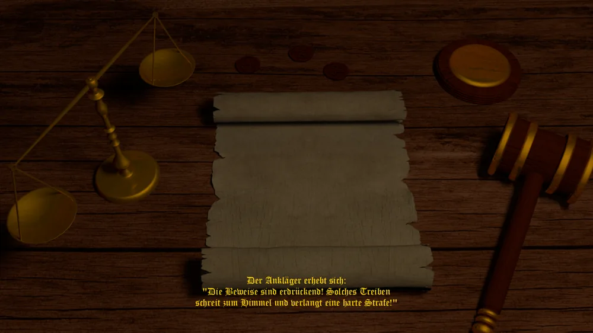

_"Wer den Richter besticht, braucht keinen Anwalt." - Sprichwort -_

Wird gegen Euch eine Anklage erhoben - oder erhebt Ihr selbst eine über das Privileg **Prozess
initiieren** -, kommt es früher oder später zur Gerichtsverhandlung. Sie wird nicht sofort ausgetragen,
sondern läuft am Ende eines Zuges mit ab, sobald sie an der Reihe ist: Seid Ihr an ihr beteiligt - als
Angeklagter, als Kläger oder als einer der drei Richter -, öffnet sich der Gerichtssaal von selbst.

## Vorstellung und Vorwürfe

Zunächst stellt der Kläger seine Anklage gegen den Angeklagten vor. Danach werden die Vorwürfe
verlesen, gegliedert nach den drei Gesetzeskategorien (Finanz-, Straf- und Kirchgesetze - siehe
[Gesetze](gesetze.md)): Jeder Vorwurf entspricht einem Gesetz, gegen das der Angeklagte tatsächlich
verstoßen hat. Eine Kategorie ohne Verstoß wird stillschweigend übersprungen.

## Aussage des Angeklagten

Seid Ihr selbst der Angeklagte, müsst Ihr Euch äußern und wählt zwischen vier Aussagen:

* **Leugnen** - hilft nur, wenn kaum Beweise vorliegen, schadet aber nie.
* **Empört leugnen** - bei dünner Beweislage überzeugender als schlichtes Leugnen; bei erdrückenden
  Beweisen nehmen die Richter Euch die dreiste Lüge jedoch übel und urteilen härter.
* **Teilgeständnis** - mildert die Strafe spürbar, erhöht aber die Neigung der Richter zur
  Verurteilung.
* **Geständnis** - führt fast sicher zur Verurteilung, senkt die Strafe dafür deutlich (auf 40 % des
  sonst üblichen Maßes).

Seid Ihr nicht der Angeklagte, hört Ihr stattdessen dessen feste Verteidigungsformel.

## Bestechung

Seid Ihr Partei des Verfahrens - Angeklagter oder Kläger -, dürft Ihr vor dem Urteil bestechen: zuerst
die Richter, danach, sofern welche aussagen, auch die Zeugen. Angeboten werden nur Beträge, die Ihr
Euch leisten könnt, gestaffelt in drei Stufen (Gering, Mittel, Hoch) bis zu dem Betrag, der alle
Bestochenen sicher überzeugt; "Nicht bestechen" steht immer zur Wahl. Eine Bestechung wirkt nur zu
Eurem Vorteil - der Angeklagte kauft sich in Richtung Freispruch frei, der Kläger in Richtung
Verurteilung, nie umgekehrt. Wurde in einem Verfahren bestochen, munkelt man davon noch vor dem Urteil.

## Zeugen

Bis zu zwei der KI-Amtsträger, die weder Partei noch Richter sind, treten als Zeugen auf. Jeder Zeuge
sagt abhängig von seinem Beziehungsunterschied zu Angeklagtem und Kläger für oder gegen den
Angeklagten aus - überzeugend bei großem Unterschied, sonst nur zögerlich. Eine Zeugenbestechung kann
einen Zeugen auf die Seite des Bestechers ziehen.

## Plädoyers

Ankläger und Verteidigung halten ihre Schlussplädoyers. Der Ton der Anklage richtet sich nach der
Beweislast (von "erdrückend" bis "windet sich"), der Ton der Verteidigung nach dem Standesansehen des
Angeklagten - ein hoher Stand (siehe [Titel](titel.md)) stimmt die Richter etwas milder.

## Das Urteil

Die drei Richter stimmen nacheinander ab. Ist einer von ihnen ein Mitspieler, entscheidet er per
Ja/Nein-Frage; KI-Richter urteilen anhand ihrer Sympathie für den Angeklagten, gewichtet mit den
tatsächlichen Verbrechen, etwaigen vom Kläger gesammelten Spionage-Beweisen, der Aussage, den
Zeugenaussagen, dem Standesansehen-Bonus und einer von der KI-Aggressivität abhängigen Zufallsspanne -
eine erfolgreiche Bestechung überstimmt das Ergebnis zugunsten des Bestechers. Sprechen mehr als einer
der drei Richter "nicht schuldig", wird der Angeklagte freigesprochen. Sonst gilt er als schuldig: Eine
zufällige Strafart wird verhängt, deren Schwere sich nach den insgesamt gegen ihn vorliegenden
Deliktpunkten richtet - gemildert oder verschärft durch die vorher gewählte Aussage.

Beachtet: Die Zahl der gegen einen Kontrahenten gesammelten Spionage-Beweise (die Beweislast) wird im
Gerichtssaal selbst nicht angezeigt, auch wenn sie im Hintergrund in das KI-Urteil einfließt. Wer
wissen will, wie stark die eigene Beweislast gegen einen Kontrahenten bereits ist, schlägt sie in dessen
[Kontrahenten-Übersicht](kontrahenten.md) nach.
