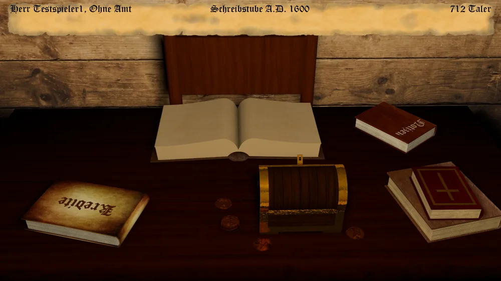

In der Schreibstube wird der meiste Papierkram erledigt.
Hier könnt Ihr Euch auf Ämter bewerben, Eure Privilegien nutzen, Gesetze einsehen und den Weg zum Geldleiher suchen.

Folgende Aktionen stehen Euch zur Verfügung:

* Auf Amt bewerben
* Privilegien
* Geldleiher
* Kreditbuch
* Gesetze
* Kontrahenten einsehen
* Hofhaltung

## Hofhaltung

Tragt Ihr einen Adelstitel, verlangt der Stand auch einen standesgemäßen Haushalt. Wählt zwischen
**sparsam**, **standesgemäß** und **aufwendig** - wer mehr Aufwand treibt, als sein Stand verlangt,
gewinnt an Ansehen, wer spart, verliert welches. Die gewählte Stufe wird jedes Jahr mit der
Jahresabrechnung fällig; ein Spieler ohne Titel hält keinen Hof und zahlt in jeder Stufe nichts.

## Die Jahresabrechnung

Am Ende Eures Zuges legt Euch der Kontor die Jahresabrechnung vor: eine Liste aller angefallenen
Kosten - Arbeiter, Betriebskosten, Transportkosten, Verkaufssteuern, Informanten, Saboteure,
Kreditzinsen, Kirchenzehnt, Zölle, Sold, Unterhalt, Kapazität, Hofhaltung und, sofern angestellt, der
Faktor - sowie die Gesamtkosten und die Änderung Eures Ansehens durch Hofhaltung und Auslastung. Die
einzelnen Posten sind in den jeweiligen Kapiteln erklärt (Kredite im [Geldleiher und
Kreditbuch](geldleiher-und-kreditbuch.md), Kirchenzehnt in der [Kirche](../kirche/index.md), Zölle bei
den [Zollburgen](../soeldner-raeuber/zollburgen.md), Sold bei den eigenen
[Stützpunkten](../soeldner-raeuber/index.md)).
