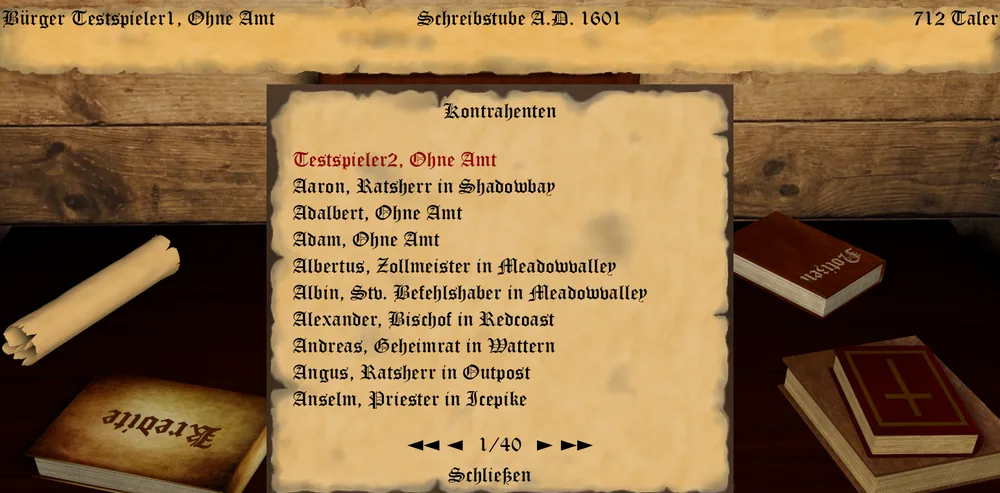
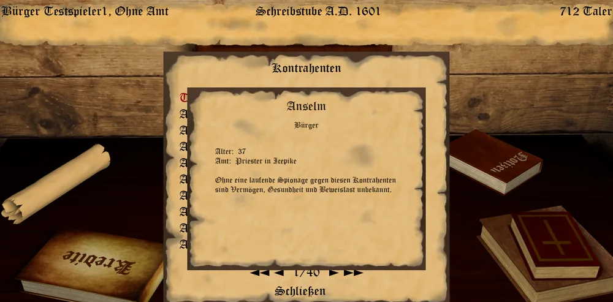

_"Zuerst ignorieren sie dich, dann lachen sie über dich, dann bekämpfen sie dich und dann gewinnst du." - Mahadma Gandhi -_

Was wäre ein Kampf ohne Herausforderer und Kontrahenten?
Im Rangeln um Macht, Ansehen und Reichtum stellen sich Euch immer wieder einige in den Weg.

Lernt Euren Gegner kennen, um zu verstehen, wie Ihr ihn besiegen könnt.
In der Schreibstube findet Ihr eine Übersicht aller im Spiel befindlicher Kontrahenten im Buch oben rechts.
Ein Klick auf den bauen Kristall der jeweiligen Person offenbart spezifische Informationen zu ihr.

## Allgemeine Informationen

Titel, Amt und Alter eines Kontrahenten seht Ihr immer, auch ohne gegen ihn zu spionieren.

* Titel
* Amt
* Alter

## Spionageinformationen

Vermögen, Gesundheit und Beweislast dagegen bleiben Euch verborgen, solange Ihr keine laufende
Spionage gegen den Kontrahenten unterhaltet - erst mit einer solchen erfahrt Ihr:

* Vermögen
* Gesundheit
* Beweislast (aufgedeckte Delikte)
* Stand der Erkenntnisse (das Jahr, aus dem die Angaben stammen)

## Wie aus Spionage Beweise werden

Die Beweislast ist eine Punktsumme, kein bloßer Zähler. Solange Eure Spionage gegen einen Kontrahenten
läuft, kann sie Euch am Ende jedes Zuges neue Beweise zutragen - abhängig von den Deliktpunkten des
Ausspähten und dem Zufall, mit einer Zugmeldung "Spionage": Eure Spione haben Euch "schwache",
"einige", "belastende" oder "stark belastende" Beweise gebracht, je nachdem, wie mächtig der einzelne
Fund war. Jeder Fund erhöht die Beweislast um seine Stärke (1 bis 4 Punkte) - sie wächst also mit jedem
weiteren Fund weiter, statt nur die Anzahl der Funde zu zählen. Bekleidet Ihr das Amt des
Kerkermeisters, tragen Euch gelegentlich auch Gefangene Beweise gegen einen fremden Amtsträger Eurer
Amtsstadt zu ("Kerkerklatsch").

Die so gesammelte Beweislast fließt in eine [Gerichtsverhandlung](gerichtsverhandlung.md) ein, sobald
Ihr als Kläger gegen einen von der KI geführten Angeklagten auftretet - im Gerichtssaal selbst wird sie
Euch allerdings nicht angezeigt, nur hier in der Kontrahenten-Übersicht.