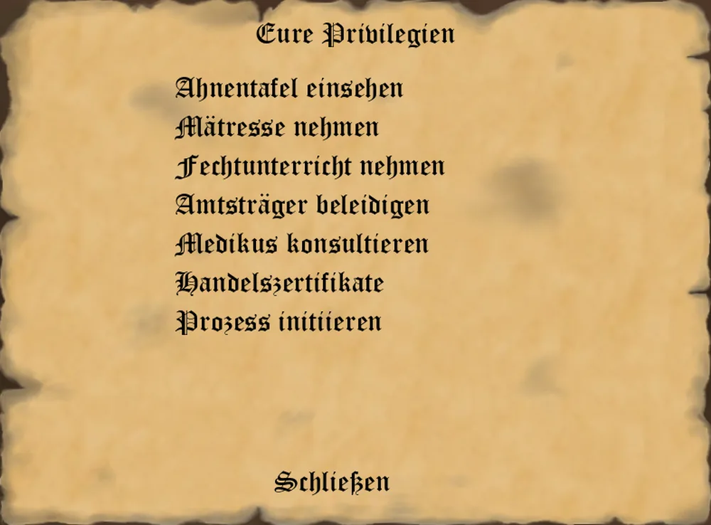
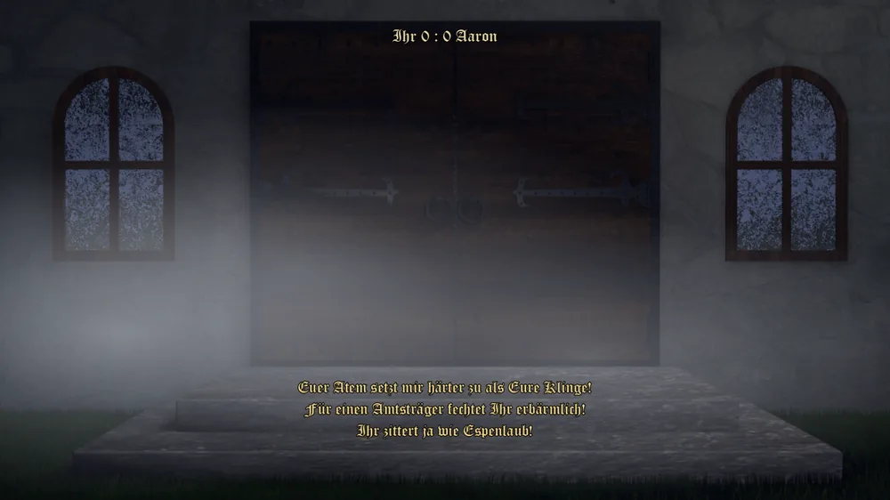

_"Alle Menschen sind gleich. Nicht die Geburt, nur die Tüchtigkeit macht einen Unterschied. - Voltair-"_

Den Tüchtigen und denen, denen die Hohen Würdenträger wohlwollend gestimmt sind, stehen viele Türen offen.
Die verschiedenen Ämter bringen zahlreiche Privilegien mit sich, um Euch gegenüber euren Kontrahenten Vorteile zu verschaffen oder sie gegeneinander auszuspielen.

Es gibt aktive Privilegien, die Ihr in jeder Runde einsetzen könnt. Andere Privilegien wirken passiv und schützen Euch und Eure Reichtümer vor Euren Kontrahenten.
Viele dieser Privilegien müsst Ihr Euch durch die Wahl in die verschiedenen Ämter erst erarbeiten. Andere stehen Euch ab Beginn oder aufgrund anderer, nicht an Ämter geknüpfter Faktoren zur Verfügung.

## Allgemeine Privilegien

_**Medikus konsultieren**_
* Voraussetzungen: keine
* Funktion: eine ungefähre Auskunft erhalten, wie viele Jahre man noch vor sich hat und wie es um seine Gesundheit bestellt ist

_**Handelszertifikate**_
* Voraussetzungen: Keine
* Funktion: Zeigt auf mit welchen Gütern der Spieler handeln darf.

_**Prozess initiieren**_
* Voraussetzungen: Keine
* Funktion: Ermöglicht es dem Spieler jemand anderen auf die Anklagebank zu zerren.

_**Testament machen**_
* Voraussetzungen: verheiratet oder rechtmäßige Erben
* Funktion: Der Spieler bestimmt, wer nach seinem Tod, dessen Vermächtnis fortführt.

_**Ahnentafel einsehen**_
* Voraussetzungen: keine
* Funktion: zeigt den Stammbaum Eurer Dynastie als Bild - Generation für Generation, mit Geburts- und
  Todesjahren, bis hin zu Eurem aktuellen Charakter. Vergangene Generationen werden beim jeweiligen
  Erbfall festgehalten, die aktuell lebende Generation (Ihr selbst, Euer Ehepartner und Eure lebenden
  Kinder) wird stets frisch aufgebaut. Eine Legende erklärt die Rahmenfarben: Euer aktueller Charakter,
  die lebende Generation, der Erbe der Dynastie und verstorbene Angehörige.

_**Mätresse nehmen**_
* Voraussetzungen: verheiratet, noch keine Mätresse, mindestens 5.000 Taler
* Funktion: Ihr nehmt Euch gegen einmalig 5.000 und jährlich 1.000 Taler eine Mätresse. Sie mehrt Euer
  Ansehen (dauerhaft um 8 Punkte) und Eure Lebensfreude (3 zusätzliche verbleibende Lebensjahre), macht
  ehelichen Nachwuchs aber seltener und birgt Jahr für Jahr ein Skandalrisiko von 1 zu 5, das 6 Punkte
  Ansehen kostet.

_**Faktor anstellen**_
* Voraussetzungen: genug Taler für den ersten Jahreslohn
* Funktion: Ein Faktor vergleicht Euch die Märkte aller Städte für eine Ware nebeneinander und warnt,
  wo Ihr sie überfüllt. Sein Lohn - fällig mit der Jahresabrechnung - wächst mit der Zahl Eurer
  Standorte; kündigen könnt Ihr ihm jederzeit.

_**Fechtunterricht nehmen**_
* Voraussetzungen: genug Taler für die nächste Stunde
* Funktion: hebt gegen einen mit jeder Stunde steigenden Preis (die erste kostet 1.000 Taler, jede
  weitere 750 Taler mehr) Eure Fechtfähigkeit um jeweils 5 Punkte - die Grundlage, um ein Duell für Euch
  zu entscheiden.

_**Amtsträger beleidigen**_
* Voraussetzungen: noch kein Duell in diesem Jahr geführt
* Funktion: fordert einen Amtsträger über die Personen-Karte heraus. Ist das Ziel ein Mitspieler,
  entscheidet er selbst, ob er Satisfaktion verlangt; eine KI verlangt sie mit einer Grundchance von
  50 % zuzüglich der Hälfte ihrer Bosheit. Verzichtet der Beleidigte, verliert er 15 Punkte Ansehen bei
  den Amtsträgern seiner eigenen Ebene (Stadt, Grafschaft oder Königreich). Kommt es zum Duell im
  Morgengrauen, entscheidet Eure Fechtfähigkeit gegen die des Gegners (bei einer KI aus ihrer Bosheit
  errechnet) über eine auf 5 bis 95 % gedeckelte Siegchance; ist die Einstellung **Duelle selbst
  austragen** aktiv, tragt Ihr das Wortgefecht in einer eigenen Inszenierung aus, sonst entscheidet ein
  Würfelwurf, begleitet von Sprüchen aus dem Nebel. Der Verlierer verliert 30 bis 50 Punkte Gesundheit
  und - fällt sie unter 30 - sein Amt, das neu besetzt wird.

  

## Von Ämtern abhängige Privilegien

### Allgemeine, amtsabhängige Privilegien

_**Amt niederlegen**_
* Voraussetzungen: Ein beliebiges Amt
* Funktion: Der Spieler legt sein Amt und alle damit verbundenen Privilegien ab.

_**Untergebene**_
* Voraussetzungen: Ein Amt, welches andere Amtsträger wählt
* Funktion: Der Spieler kann eine Amtsenthebung für einen seiner Untergebenen beantragen. Über den
  Antrag stimmen die übrigen Wähler desselben Amtes einzeln ab, Stimme für Stimme per Rechtsklick
  aufgedeckt; setzt sich die Absetzung durch, wird das Amt frei und in der nächsten Wahl neu besetzt.

_**Bauwerk stiften**_
* Voraussetzungen: Ein grafschaftliches Amt oder höher
* Funktion: Stiftet einer Stadt ein Bauwerk um damit sein Ansehen und den Reichtum der Stadt zu mehren.

### Amtsabhängige Privilegien auf Stadt-Ebene

_**Steuerhinterziehung-A**_
* Voraussetzungen: Ratsherr
* Funktion: Steuerausgaben reduzieren

_**Korruptionsgelder**_
* Voraussetzungen: Stadtwache
* Funktion: gelegentlich kleine Bestechungsgelder

_**Kerkerklatsch**_
* Voraussetzungen: Kerkermeister
* Funktion: Der Spieler erfährt gelegentlich von kriminellen Taten seiner Konkurrenten in derselben Stadt.

_**Hand des Henkers**_
* Voraussetzungen: Henker
* Funktion: jemanden berühren und dadurch dessen Ansehen schmälern

_**Confessio**_
* Voraussetzungen: Priester
* Funktion: Andere Konkurrenten gehen unwahrscheinlicher gegen den Spieler vor.

_**Prediger**_
* Voraussetzungen: Priester
* Funktion: Arbeiter produzieren etwas mehr

_**Sparplan**_
* Voraussetzungen: Baumeister
* Funktion: Wohnsitze günstiger errichten

_**Umsatzsteuer festlegen**_
* Voraussetzungen: Bürgermeister
* Funktion: Umsatzsteuer seiner Stadt verändern

### Amtsabhängige Privilegien auf Grafschafts-Ebene

_**Steuerhinterziehung-B**_
* Voraussetzungen: Geheimrats
* Funktion: Steuerausgaben reduzieren

_**Schmuggel**_
* Voraussetzungen: Zöllners oder Zollmeisters
* Funktion: Einkommen durch Schmuggel

_**Zollkartell**_
* Voraussetzungen: Zollmeisters
* Funktion: keine Zölle entrichten

_**Vergifteter Wein**_
* Voraussetzungen: Kellermeister
* Funktion: Ermordung vergünstigt durchführen

### Amtsabhängige Privilegien auf Königreichs-Ebene

_**Wachen**_
* Voraussetzungen: Vogts, Bischofs, Hauptmanns oder Hofrats
* Funktion: Spionage- und Sabotageakte der Konkurrenten sind seltener erfolgreich

_**Kirchengesetze festlegen**_
* Voraussetzungen: Erzbischofs
* Funktion: Kirchgesetze ändern

_**Finanzgesetze festlegen**_
* Voraussetzungen: Finanzministers
* Funktion: Finanzgesetze ändern

_**Strafgesetze festlegen**_
* Voraussetzungen: Justizministers
* Funktion: Strafgesetze ändern

_**Leibgarde**_
* Voraussetzungen: Regents, Erzbischofs oder Feldmarschalls
* Funktion: Spionage- und Sabotageakte der Konkurrenten sind viel seltener erfolgreich