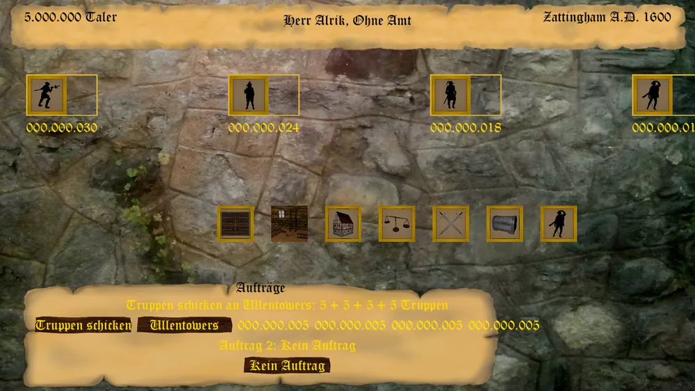

"Reiten und Rauben ist keine Schanden. Das tun auch die Besten im Lande." - deutsches Sprichwort .

Warum die Mühe machen, Burschen, Werkstätten, Lagerraum und Warenexoprte zu organisieren?
Sollen Eure Kontrahenten diesen Schreibkram doch ruhig machen, während ihr den schönen Dingen des Lebens nachgeht und Eure Spitzbuben die Waren eurer Kontrahenten, schon hergestellt und verkaufsfähig verpackt, einfach in Eure Kontore "umlagern"?
Spart das nicht am Ende auch das lästige Gefeilsche über den Verkaufspreis? Was kümmert es euch? Waren dies edlen Stoffe und der exotische Pfeffer in der Beschaffung nicht durchaus "günstig"?

Im Bildschirm Räuber & Söldner seht ihr auf der Landkarte des Königreiches die verschiedenen Räuberlager und Zollburgen, die ihr erwerben oder einnehmen könnt.
Ein Linksklick auf eines zeigt euch die dazugehörigen Informationen an.

* Name
* Besitzer 
* Zustand in %
* Tarnung in %
* aktueller Wert

Ihr habt nun die Möglichkeit, ein entsprechendes Kaufangebot an den jeweiligen Besitzer zu unterbreiten. Doch bedenkt - die Mühe dafür könnt ihr nur einmal pro Jahr aufbringen. Wenn dann der angebotene Kaufpreis nicht den Erwartungen genügt, war alles Vergebens und ihr müsst euch bis nächstes Jahr gedulden.

## Einen eigenen Stützpunkt verwalten

Gehört Euch ein Räuberlager oder eine Zollburg, führt ein Linksklick nicht zum Kaufangebot, sondern in
die Verwaltung. Oben seht Ihr die vier Truppenarten des Stützpunkts (bei einer Zollburg Söldner,
Musketiere, Kanoniere und Offiziere; bei einem Räuberlager Räuber, Bombenleger, Kanoniere und Schützen)
samt ihrer Anzahl. Stellt die Zahl unter einem Symbol auf das gewünschte Ergebnis und klickt das Symbol
an, um Truppen dieser Art anzuheuern oder – bei einem niedrigeren Wert – nach Rückfrage zu entlassen.

Darunter findet Ihr die Ausbauten, jeweils über den Prozentwert-Dialog festzulegen:

* **Sicherheit** (Zollburg) bzw. **Tarnung** (Räuberlager) ausbauen
* **Zustand** reparieren
* **Unterkünfte** ausbauen (die Kapazität, bis zu der Ihr überhaupt Truppen unterbringen könnt)
* bei einer Zollburg zusätzlich den **Zollsatz** festlegen

Ein **Manöver** kostet, gestaffelt nach Truppenstärke und aktueller Moral, zwischen 40 % und 100 % von
100 Taler je Einheit. Ein Wurf entscheidet über den Ausgang: meist (in 17 von 20 Fällen) steigt die
Moral der Truppe um 2 Punkte, gelegentlich bleibt sie unverändert, in einem von zwanzig Fällen sinkt sie
sogar um 1 Punkt. Wer den Stützpunkt loswerden will, kann ihn zudem **zum Verkauf anbieten** – KI-Spieler
unterbreiten dann von Zeit zu Zeit ein Kaufangebot, das Euch zu Beginn eines Zuges vorgelegt wird. Vor
einer bevorstehenden Schlacht lässt sich außerdem einmalig ein **Moral-Bonus** erkaufen (100 Taler je
stationierter Einheit) – gewinnt Ihr die Schlacht, wird er Euch zurückerstattet.

Ganz unten legt Ihr bis zu zwei **Aufträge** fest: Je Auftragszeile schaltet ein Klick zwischen „Kein
Auftrag", „Truppen schicken" (Ziel: ein anderer eigener Stützpunkt) und – je nach Art des Stützpunkts –
„Überwachen" oder „Plündern" (Ziel: eine Grafschaft) um. Anschließend teilt Ihr dem Auftrag zu, wie viele
Truppen jeder Art daran teilnehmen sollen; welche Truppen dem einen Auftrag bereits zugeteilt sind,
stehen dem anderen nicht mehr zur Verfügung. Die Aufträge laufen am Rundenende.

